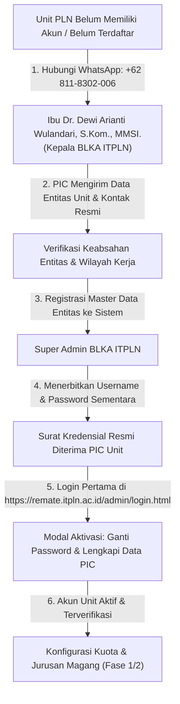

# DOKUMENTASI SISTEM ANALIS & BLUEPRINT PITCH DECK SOSIALISASI
# PORTAL MITRA PERUSAHAAN REMATE (REKRUTMEN & MAGANG TERPADU)
## Kolaborasi Strategis Kampus ITPLN & Seluruh Unit PT PLN (Persero) se-Indonesia

---

## DAFTAR ISI
1. [BAGIAN I: EXECUTIVE SUMMARY & ARSITEKTUR BISNIS](#bagian-i-executive-summary--arsitektur-bisnis)
   - Latar Belakang & Transformasi Digital Magang
   - Hierarki Entitas Unit PLN dalam Sistem
   - Siklus Hidup Magang (The 3 Lifecycle Phases)
   - Alur Registrasi Akun & Pendaftaran Unit Baru (Bagan Alir Operasional)
2. [BAGIAN II: MASTER SLIDE DECK BLUEPRINT (SLIDE 1 - 26)](#bagian-ii-master-slide-deck-blueprint)
   - Setiap slide dilengkapi: Judul, Visual Wireframe/Layout, Key Takeaways, dan Naskah Presenter (Speaker Notes)
3. [BAGIAN III: PANDUAN TEKNIS OPERASIONAL PIC (SOP STEP-BY-STEP)](#bagian-iii-panduan-teknis-operasional-pic)
   - Modul 0: Prosedur Pembukaan Akun & Pendaftaran Unit Baru via BLKA ITPLN
   - Modul 1: Aktivasi Akun Perdana & Kredensial Resmi
   - Modul 2: Konfigurasi Kuota, Prodi & Pemetaan Peminatan
   - Modul 3: Seleksi Berkas, Drawer Digital & Keputusan Penerimaan
   - Modul 4: Manajemen Pemindahan Mahasiswa (Outbound, Inbound & Rekomendasi Cerdas)
   - Modul 5: Roster Final Mahasiswa Sah & Ekspor Paket Arsip ZIP
4. [BAGIAN IV: MATRIKS KOMPREHENSIF SKENARIO KHUSUS & EDGE CASES (THE "WHAT-IF?" BIBLE)](#bagian-iv-matriks-komprehensif-skenario-khusus--edge-cases)
   - Pembahasan mendalam 17 Skenario Kritis di Lapangan
5. [BAGIAN V: CHEAT SHEET & SOP CHECKLIST RINGKAS PIC](#bagian-v-cheat-sheet--sop-checklist-ringkas-pic)
6. [BAGIAN VI: ESKALASI & KONTAK PUSAT BANTUAN BLKA ITPLN](#bagian-vi-eskalasi--kontak-pusat-bantuan-blka-itpln)

---

# BAGIAN I: EXECUTIVE SUMMARY & ARSITEKTUR BISNIS

### 1.1 Latar Belakang & Transformasi Digital
Sebelum adanya platform REMATE (Rekrutmen & Magang Terpadu) v2, proses administrasi magang mahasiswa Institut Teknologi PLN (ITPLN) di lingkungan PT PLN (Persero) menghadapi kendala klasik:
* **Fragmentasi Data:** Pendaftaran mahasiswa dilakukan secara parsial melalui email, proposal fisik, atau memo internal yang tidak tersinkronisasi.
* **Kesenjangan Informasi Kuota:** Unit PLN sering kali tidak mengetahui jurusan apa saja yang tersedia, sementara mahasiswa tidak mengetahui unit mana yang kuotanya masih kosong.
* **Risiko Deadlock Talenta:** Mahasiswa unggulan yang mendaftar di satu unit populer tertolak dan kehilangan kesempatan, padahal unit pelaksana lain di wilayah terdekat sedang kekurangan kandidat.
* **Beban Administrasi Manual:** PIC Unit harus mengumpulkan berkas transkrip, CV, dan surat pengantar satu per satu dalam format terpisah.

REMATE v2 hadir sebagai platform terpadu satu pintu (*single window platform*) yang menghubungkan Biro Layanan Karir dan Alumni (BLKA) ITPLN dengan seluruh kantor PLN se-Indonesia mulai dari Kantor Pusat, Unit Induk, Unit Pelaksana, hingga Unit Layanan.

### 1.2 Hierarki Entitas Unit PLN dalam Sistem
Sistem REMATE merefleksikan struktur organisasi riil PT PLN (Persero) menggunakan pemetaan relasi induk-anak (*parent-child relationship*):
1. **Holding / Kantor Pusat:** Level tertinggi entitas perusahaan (PT PLN Persero Kantor Pusat).
2. **Unit Induk:** Meliputi Unit Induk Distribusi (UID), Unit Induk Penyaluran & Pusat Pengatur Beban (UIP3B), Unit Induk Transmisi (UIT), Unit Induk Pembangunan (UIP), dan Unit Induk Wilayah (UIW).
3. **Unit Pelaksana:** Meliputi Unit Pelaksana Pelayanan Pelanggan (UP3), Unit Pelaksana Proyek (UPP), Unit Pelaksana Pengatur Distribusi (UP2D), Unit Pelaksana Transmisi (UPT), dan Pusat Pemeliharaan Ketenagalistrikan (Pusharlis).
4. **Unit Layanan:** Meliputi Unit Layanan Pelanggan (ULP), Unit Layanan Transmisi dan Gardu Induk (ULTG), serta pos kerja teknis lapangan.

Setiap PIC Unit Pelaksana dan Unit Layanan memiliki akun independen untuk menentukan daya tampung unit masing-masing, namun aktivitasnya tetap dapat dipantau oleh Unit Induk dan BLKA Pusat.

### 1.3 Siklus Hidup Magang (The 3 Lifecycle Phases)
Alur operasional di dalam portal admin perusahaan terbagi menjadi 3 fase terstruktur yang diwakili oleh indikator *Stepper Siklus Tahap Magang* di dashboard:
* **Fase 1: Setup Kuota Unit (Masa Persiapan):** Unit menentukan apakah menerima magang atau tidak, memasang kuota total, memilih metode pembagian kuota, memilih jurusan ITPLN yang dibutuhkan, serta memetakan bidang peminatan divisi.
* **Fase 2: Seleksi & Verifikasi Berkas (Periode Dibuka):** Pendaftaran mahasiswa aktif (*live*). Mahasiswa memilih unit, mereservasi kuota, dan mengirim berkas pendaftaran. PIC unit memverifikasi berkas pendaftar masuk, mengambil keputusan (Terima / Tolak), atau mengajukan pemindahan unit.
* **Fase 3: Penetapan & Roster Mahasiswa Sah (Periode Selesai):** BLKA ITPLN menerbitkan penetapan kelulusan resmi. Tab Roster aktif, menampilkan kartu identitas seluruh mahasiswa yang sah diterima. PIC unit dapat langsung menghubungi mahasiswa via WhatsApp/Email dan mengunduh paket arsip ZIP berisi rekap Excel dan folder berkas PDF per mahasiswa.

### 1.4 Alur Registrasi Akun & Pendaftaran Unit Baru
Bagi kantor atau unit kerja di lingkungan PT PLN (Persero) yang belum memiliki akses portal atau belum terdata pada hierarki sistem REMATE v2, proses permohonan pembukaan akun baru dilakukan secara terpusat melalui Biro Layanan Karir dan Alumni (BLKA) ITPLN:



#### Prinsip Tata Kelola Pendaftaran Unit Baru:
1. **Validasi Satu Pintu:** Menjamin hanya unit PLN resmi dan sah yang terdaftar di sistem, mencegah duplikasi akun atau pembagian wilayah kerja yang tumpang tindih.
2. **Kecepatan Respons (SLA):** Verifikasi dan penerbitan akun diproses maksimal 1x24 jam kerja sejak data unit lengkap diterima oleh Kepala BLKA.
3. **Fleksibilitas Periode:** Unit baru yang terdaftar saat periode magang sedang berlangsung tetap dapat langsung mengaktifkan kuota formasi (*open late quota*).

---

# BAGIAN II: MASTER SLIDE DECK BLUEPRINT

Berikut adalah rancangan slide demi slide yang siap dipindahkan ke format presentasi (PowerPoint / Canva / Google Slides) untuk kegiatan sosialisasi kepada seluruh PIC PLN.

---

### SLIDE 1: JUDUL & PEMBUKA
* **Header:** Sosialisasi Aplikasi REMATE ITPLN
* **Sub-Header:** Panduan Operasional Portal Mitra Unit PT PLN (Persero) untuk Rekrutmen & Administrasi Magang Terpadu
* **Visual / Layout:** Logo resmi PLN berdampingan dengan logo ITPLN. Di latar belakang terdapat ilustrasi grafis jaringan kelistrikan modern dan antarmuka dashboard REMATE.
* **Key Takeaways:**
  - Selamat datang di ekosistem baru pengelolaan magang terpusat.
  - Sinergi digital antara kampus korporat ITPLN dan unit PLN se-Indonesia.
* **Speaker Notes (Naskah Presenter):**
  > "Bapak dan Ibu PIC Unit PLN yang kami hormati dari Sabang sampai Merauke, selamat datang di sesi sosialisasi aplikasi REMATE v2. Hari ini kita akan membedah secara tuntas bagaimana portal ini mempermudah Bapak dan Ibu dalam merencanakan kebutuhan formasi magang, memverifikasi calon peserta dalam hitungan menit, hingga mengunduh dokumen resmi tanpa hambatan birokrasi manual."

---

### SLIDE 2: LATAR BELAKANG & TUJUAN STRATEGIS
* **Header:** Mengapa REMATE v2 Hadir?
* **Sub-Header:** Menjawab Tantangan Pengelolaan Talenta Magang Masa Depan
* **Visual / Layout:** Kolom komparasi 2 sisi: *Sebelumnya (Proses Manual)* vs *Sekarang (Platform Terpadu REMATE)*.
* **Key Takeaways:**
  - Mengakhiri tumpang tindih pendaftaran proposal mahasiswa ke unit.
  - Memberikan kepastian kuota dan kualifikasi program studi yang tepat sasaran.
  - Menyediakan transparansi data *real-time* antara unit kerja dan institusi pendidikan.
* **Speaker Notes:**
  > "Sebelumnya, unit sering menerima pengajuan mahasiswa yang tidak sesuai kebutuhan formasi atau jurusan. Di sisi lain, ada unit yang membutuhkan banyak mahasiswa teknik tenaga listrik namun tidak mendapatkan pendaftar. Melalui REMATE, seluruh data disinkronkan secara terpusat sehingga unit mendapatkan kandidat terbaik sesuai spesifikasi teknis pekerjaan di lapangan."

---

### SLIDE 3: HIERARKI UNIT & KEDAULATAN OPERASIONAL PIC
* **Header:** Arsitektur Organisasi & Hak Akses
* **Sub-Header:** Menghubungkan Kantor Pusat, Unit Induk, Unit Pelaksana, dan Unit Layanan
* **Visual / Layout:** Bagan pohon organisasi (*organogram tree*) interaktif yang menunjukkan relasi: Holding $\rightarrow$ UID/UIP/UIT $\rightarrow$ UP3/UPP $\rightarrow$ ULP.
* **Key Takeaways:**
  - Setiap unit memiliki otonomi penuh menentukan kapasitas dan jurusan yang diinginkan.
  - Akun terikat spesifik ke entitas unit kantor masing-masing.
  - Koordinasi lintas unit difasilitasi oleh fitur pemindahan otomatis.
* **Speaker Notes:**
  > "Sistem REMATE dibangun mengikuti struktur organisasi PLN yang sesungguhnya. Akun yang Bapak/Ibu pegang saat ini secara presisi terikat pada Unit Pelaksana atau Unit Layanan masing-masing. Anda memiliki hak penuh untuk menerima, menolak, atau memindahkan mahasiswa sesuai dinamika lapangan tanpa intervensi pihak luar yang merugikan unit."

---

### SLIDE 4: ANATOMI SIKLUS HIDUP MAGANG (3 TAHAPAN UTAMA)
* **Header:** Tiga Fase Operasional Utama
* **Sub-Header:** Alur Kerja Jelas, Terukur, dan Sistematis
* **Visual / Layout:** Timeline linear dengan 3 simpul interaktif: Simpul 1 (Persiapan Kuota), Simpul 2 (Pendaftaran & Seleksi Berkas), Simpul 3 (Penetapan & Roster Sah).
* **Key Takeaways:**
  - **Fase 1:** Atur kuota, prodi, dan peminatan sebelum pendaftaran dibuka.
  - **Fase 2:** Pantau dan seleksi pendaftar yang masuk secara harian.
  - **Fase 3:** Unduh arsip lengkap dan hubungi mahasiswa resmi untuk *onboarding*.
* **Speaker Notes:**
  > "Bapak/Ibu tidak perlu bingung mengenai apa yang harus dilakukan saat login. Dashboard REMATE memiliki stepper status otomatis. Ketika periode berada pada Fase 1, fokus kita adalah menentukan kuota. Saat masuk Fase 2, fokus kita beralih ke seleksi berkas. Dan saat Fase 3 tiba, pekerjaan kita adalah menerima daftar nama mahasiswa sah beserta dokumen arsipnya."

---

### SLIDE 5: AKTIVASI AKUN PERDANA & REGISTRASI UNIT BARU
* **Header:** Langkah Pertama: Aktivasi Kredensial & Registrasi Akun
* **Sub-Header:** Tata Cara Permohonan Akun Unit Baru dan Pengamanan Kredensial Perdana
* **Visual / Layout:**
  - **Panel Kiri:** Infografis 4 langkah pembukaan akun unit baru (Kontak WhatsApp BLKA $\rightarrow$ Kirim Data Unit $\rightarrow$ Verifikasi BLKA $\rightarrow$ Kredensial Terbit).
  - **Panel Kanan:** Mockup antarmuka modal *Aktivasi Akun & Ubah Password Perdana* (Input Nama PIC, No WhatsApp, Password Baru, dan Konfirmasi).
  - **Callout Banner Emas:** Kontak Khusus Kepala BLKA ITPLN: **Ibu Dr. Dewi Arianti Wulandari, S.Kom., MMSI. (`+62 811-8302-006`)**.
* **Key Takeaways:**
  - **Unit Belum Terdaftar:** Hubungi langsung Kepala BLKA ITPLN via WhatsApp di `+62 811-8302-006` untuk validasi entitas dan penerbitan akun dinas (SLA 1x24 jam kerja).
  - **Wajib Ganti Password:** Password default/sementara dari BLKA wajib diganti pada saat pertama kali login demi privasi dan keamanan data unit.
  - **Integritas Kontak PIC:** Nomor WhatsApp dan Email resmi pejabat penanggung jawab wajib diisi agar sistem dapat mengalirkan pengingat otomatis dan menghubungkan mahasiswa terpilih secara langsung.
* **Speaker Notes:**
  > "Bapak dan Ibu yang kami hormati, sebelum melangkah lebih jauh ke dalam sistem, hal pertama yang perlu diperhatikan adalah kepemilikan akun. Bagi unit yang telah menerima surat edaran dinas dan memegang kredensial awal, silakan langsung login di `remate.itpln.ac.id/admin/login.html` dan selesaikan modal aktivasi dengan mengganti kata sandi rahasia serta melengkapi nomor WhatsApp aktif PIC.
  >
  > Namun, jika ada Unit Pelaksana (UP3/UPP) atau Unit Layanan (ULP) di lingkungan wilayah Bapak/Ibu yang saat ini belum terdaftar di sistem dan ingin membuka pintu magang bagi talenta mahasiswa ITPLN, jalurnya sangat mudah dan responsif: silakan langsung menghubungi Kepala BLKA ITPLN, Ibu Dr. Dewi Arianti Wulandari di nomor WhatsApp +62 811-8302-006. Sampaikan nama unit dan identitas PIC, tim BLKA akan segera memverifikasi dan menerbitkan kredensial resmi maksimal dalam 1x24 jam kerja."

---

### SLIDE 6: PENGENALAN DASHBOARD & EXECUTIVE CONTEXT BAR
* **Header:** Antarmuka Utama Portal Mitra
* **Sub-Header:** Informasi Terpusat, Ringkas, dan Informatif
* **Visual / Layout:** Screenshot bagian atas dashboard: Navbar dengan badge unit, Executive Context Bar (Nama Unit, PIC Info, Periode Aktif, Status Fase), serta Bottom Navigation Bar.
* **Key Takeaways:**
  - Executive Context Bar selalu menampilkan identitas unit dan status periode terkini.
  - Kartu PIC Cepat memberikan informasi kontak PIC yang sedang aktif bertugas.
  - Navigasi tab terletak di bagian bawah layar agar mudah diakses dari perangkat laptop maupun tablet.
* **Speaker Notes:**
  > "Tampilan dashboard kami rancang dengan standar antarmuka PLN Enterprise modern. Di bagian atas terdapat Executive Context Bar yang selalu mengingatkan status periode magang saat ini. Navigasi menu utama terletak rapi di bilah navigasi bawah, mencakup menu Ringkasan, Pengaturan Kuota, Verifikasi Peserta, Pemindahan Mahasiswa, dan Roster Mahasiswa Sah."

---

### SLIDE 7: METODE KUOTA: GABUNGAN (POOL) VS TERBAGI (BREAKDOWN)
* **Header:** Konfigurasi Daya Tampung Unit
* **Sub-Header:** Memilih Strategi Kuota Sesuai Kebutuhan Divisi Kerja
* **Visual / Layout:** Komparasi grafis 2 card: Card A *Kuota Gabungan (Pool)* dengan 1 angka total dan Card B *Kuota Terbagi per Prodi (Breakdown)* dengan input alokasi angka per jurusan.
* **Key Takeaways:**
  - **Kuota Gabungan (Pool):** Seluruh jurusan yang dipilih bersaing memperebutkan satu total kuota unit (Fleksibilitas maksimal).
  - **Kuota Terbagi (Breakdown):** Setiap program studi memiliki jatah kuota angka pasti yang tidak dapat saling menggeser (Presisi formasi).
* **Speaker Notes:**
  > "Saat mengatur kuota, unit diberikan 2 pilihan strategi. Pilihan pertama adalah Kuota Gabungan atau Pool: misalnya total 10 mahasiswa untuk jurusan Teknik Elektro, Teknik Mesin, dan Informatika. Siapa kandidat terbaik dari ketiga jurusan tersebut akan mengisi slot sampai total 10 penuh. Pilihan kedua adalah Breakdown: unit mematok secara kaku, misal 5 Elektro, 3 Mesin, dan 2 Informatika. Silakan pilih metode yang paling cocok dengan kultur kerja unit Bapak/Ibu."

---

### SLIDE 8: PEMETAAN BIDANG PEMINATAN & RELASI PROGRAM STUDI
* **Header:** Pemetaan Divisi Kerja & Minat Kompetensi
* **Sub-Header:** Memastikan Mahasiswa Ditempatkan Sesuai Relevansi Jurusan
* **Visual / Layout:** Tampilan form checkbox peminatan dengan badge relasi jurusan di bawah judul peminatan (contoh: *Peminatan Operasi & Distribusi Tenaga Listrik* $\rightarrow$ badge *S1 Teknik Elektro, D3 Teknik Listrik*).
* **Key Takeaways:**
  - Setiap peminatan otomatis menampilkan program studi mana saja yang relevan.
  - Mahasiswa yang mendaftar wajib memilih minimal satu bidang peminatan unit.
  - Mencegah mahasiswa salah penempatan divisi sejak hari pertama magang.
* **Speaker Notes:**
  > "Di bawah pilihan jurusan, terdapat daftar Bidang Peminatan atau Penempatan Divisi. Perhatikan bahwa di setiap kartu peminatan, sistem menampilkan tag jurusan apa saja yang terhubung ke bidang tersebut. Dengan demikian, unit tidak perlu khawatir mahasiswa jurusan non-teknis masuk ke divisi operasi distribusi transmisi, karena sistem telah memvalidasi prasyarat jurusannya secara otomatis."

---

### SLIDE 9: KASUS OPERASIONAL 1: UNIT TELAT ATUR KUOTA DI FASE 2
* **Header:** Kasus Khusus: Periode Sudah Dibuka, Unit Baru Sempat Konfigurasi
* **Sub-Header:** Fleksibilitas Sistem dalam Mengakomodasi Keterlambatan Administrasi
* **Visual / Layout:** Diagram alur status: *Periode Status = DIBUKA* $\rightarrow$ *Unit Kuota = 0* $\rightarrow$ *Formulir Tetap Terbuka Penuh* $\rightarrow$ *Simpan Kuota* $\rightarrow$ *Unit Seketika Muncul Live di Mahasiswa*.
* **Key Takeaways:**
  - Sistem tidak mengunci unit yang baru sempat mengatur kuota saat periode sudah berstatus *DIBUKA*.
  - Formulir kuota tetap terbuka penuh (Metode, Kuota Total, Jurusan, dan Peminatan bebas dipilih).
  - Seketika tombol Simpan ditekan, unit langsung terbit di aplikasi mahasiswa.
* **Speaker Notes:**
  > "Salah satu pertanyaan yang sering diajukan: 'Bagaimana jika periode magang sudah dibuka oleh BLKA, tapi unit kami baru menerima surat instruksi dan baru sempat membuka portal hari ini?' Jawabannya: Sistem REMATE sangat fleksibel. Bapak/Ibu tetap bisa login, mengatur kuota dari nol, dan menyimpan pengaturan. Begitu tombol simpan ditekan, unit Bapak/Ibu langsung tayang secara live di layar pencarian mahasiswa."

---

### SLIDE 10: ATURAN PENGUNCIAN KUOTA SAAT PERIODE DIBUKA (LIVE)
* **Header:** Proteksi Keamanan Kuota Eksisting
* **Sub-Header:** Menjaga Kepastian Hak Mahasiswa yang Sedang Mendaftar
* **Visual / Layout:** Ilustrasi kotak pemberitahuan amber: *Aturan Periode DIBUKA: Hanya Boleh Menambah Kuota, Metode Terkunci, Unit Dilarang Dinonaktifkan*.
* **Key Takeaways:**
  - Jika unit **sudah memiliki kuota aktif** saat periode live, total kuota **hanya boleh ditambah**, tidak boleh dikurangi.
  - Metode kuota (Pool / Breakdown) terkunci agar tidak merusak alokasi yang sudah berjalan.
  - Toggle penerimaan magang tidak dapat dimatikan sepihak saat pendaftar sudah masuk.
* **Speaker Notes:**
  > "Namun, ada satu batasan penting yang perlu dipahami: Jika unit Bapak/Ibu sudah pernah mengatur kuota sebelumnya (misal 5 slot) dan pendaftaran sedang berlangsung, Bapak/Ibu dilarang menurunkan kuota menjadi 3 atau mematikan unit. Hal ini demi kepastian hukum bagi mahasiswa yang sudah mendaftar. Anda hanya diizinkan menambah kuota, misalnya dari 5 menjadi 8 atau 10 slot."

---

### SLIDE 11: FASE 2: MEKANISME RESERVASI & HOLDING SLOT MAHASISWA
* **Header:** Cara Mahasiswa Mendaftar & Mengunci Kuota
* **Sub-Header:** Sistem Reservasi Real-Time untuk Mencegah Perebutan Kuota
* **Visual / Layout:** Skema interaksi: *Mahasiswa Pilih Unit* $\rightarrow$ *Slot Ditahan (Holding)* $\rightarrow$ *Unggah Berkas Wajib (Transkrip/CV/Porto)* $\rightarrow$ *Submit Resmi*.
* **Key Takeaways:**
  - Mahasiswa melakukan reservasi slot sebelum mengirimkan formulir pendaftaran.
  - Kuota tersisa unit berkurang 1 sementara waktu selama mahasiswa melengkapi berkas.
  - Jika mahasiswa tidak menyelesaikan pengiriman dalam batas waktu, slot kembali terbuka otomatis.
* **Speaker Notes:**
  > "Bagaimana mahasiswa mendaftar ke unit Bapak/Ibu? Ketika mahasiswa menekan tombol reservasi pada unit Anda, sistem mengunci satu slot kuota untuk mahasiswa tersebut. Ini memberi waktu tenang bagi mahasiswa untuk mengunggah berkas transkrip dan CV resminya tanpa takut kuotanya diserobot pendaftar lain. Kuota baru benar-benar terikat permanen saat mahasiswa menekan tombol submit pendaftaran."

---

### SLIDE 12: ANTARMUKA VERIFIKASI PESERTA & TUGAS MENDESAK HARI INI
* **Header:** Menu Verifikasi Peserta
* **Sub-Header:** Pusat Komando Seleksi Berkas Calon Mahasiswa Magang
* **Visual / Layout:** Screenshot tabel Verifikasi Peserta lengkap dengan badge status pendaftar, data akademik (IPK, SKS, Program), kontak, dan action cell (Pill Berkas & Tombol Keputusan).
* **Key Takeaways:**
  - Menampilkan seluruh pendaftar yang masuk ke unit secara urut waktu pengajuan (*FIFO*).
  - Terdapat indikator khusus jika pendaftar merupakan hasil pemindahan dari unit lain.
  - Action checklist di dashboard memberikan pengingat harian jumlah berkas yang belum diverifikasi.
* **Speaker Notes:**
  > "Di menu Verifikasi Peserta inilah aktivitas harian PIC berlangsung. Bapak/Ibu dapat melihat nama mahasiswa, NIM, program studi, angkatan, IPK, dan jumlah SKS kumulatif. Jika pendaftar tersebut merupakan hasil limpahan rekomendasi dari unit lain, akan muncul tanda khusus 'Dipindahkan'. Kartu checklist di dashboard depan akan selalu mengingatkan berapa berkas yang masih menunggu keputusan Anda."

---

### SLIDE 13: REVIEW BERKAS VIA DRAWER PREVIEW DIGITAL
* **Header:** Pratinjau Dokumen Cepat & Tanpa Buka Tab Baru
* **Sub-Header:** Menilai Kelayakan Akademik dan Profil Kandidat Secara Efisien
* **Visual / Layout:** Screenshot layar saat tombol baris diklik: Drawer samping muncul dari kanan layar, menampilkan avatar mahasiswa, statistik akademik, catatan internal, dan tombol pratinjau dokumen (Transkrip, CV, Portofolio).
* **Key Takeaways:**
  - Cukup klik baris mahasiswa untuk membuka Drawer Pratinjau Dokumen di sisi kanan layar.
  - Membuka dokumen Transkrip Nilai, CV, dan Portofolio langsung di tab baru dengan tautan aman.
  - PIC dapat membaca catatan riwayat pemindahan jika mahasiswa tersebut adalah mahasiswa transfer.
* **Speaker Notes:**
  > "Kami menyadari waktu Bapak/Ibu sangat berharga. Anda tidak perlu membuka banyak jendela untuk memeriksa berkas. Cukup klik pada baris nama mahasiswa, maka drawer digital akan muncul di sisi kanan. Dari drawer tersebut, Bapak/Ibu dapat mengklik tombol 'Lihat PDF' untuk membuka Transkrip Nilai Akademik, CV, maupun Portofolio mahasiswa secara instan."

---

### SLIDE 14: KEPUTUSAN PENERIMAAN: MENGUNCI STATUS "DITERIMA"
* **Header:** Keputusan Seleksi: Menerima Pendaftar
* **Sub-Header:** Menetapkan Mahasiswa Lolos Kualifikasi Unit
* **Visual / Layout:** Screenshot modal konfirmasi penerimaan berwarna hijau, dengan kolom *Catatan Penerimaan (Opsional)* dan tombol konfirmasi *Ya, Terima Mahasiswa*.
* **Key Takeaways:**
  - Klik tombol hijau bertuliskan **Terima** pada baris pendaftar.
  - Muncul modal konfirmasi yang merangkum nama mahasiswa dan prodi.
  - PIC dapat menambahkan catatan internal (misal: *Memenuhi syarat IPK dan keahlian kelistrikan*).
  - Status berubah menjadi **DITERIMA** dan kuota unit terkunci sah.
* **Speaker Notes:**
  > "Jika setelah memeriksa transkrip dan CV Bapak/Ibu merasa kandidat tersebut cocok dengan kebutuhan unit, cukup klik tombol 'Terima'. Anda bisa menyematkan catatan singkat sebagai dokumentasi internal unit. Begitu disetujui, mahasiswa tersebut resmi masuk ke kuota unit Anda dan siap melangkah ke tahap penetapan akhir."

---

### SLIDE 15: KEPUTUSAN PENOLAKAN & MEKANISME AUTOMATIC REFUND KUOTA
* **Header:** Keputusan Seleksi: Menolak Pendaftar
* **Sub-Header:** Transparansi Alasan & Pengembalian Kuota Unit Secara Real-Time
* **Visual / Layout:** Screenshot modal penolakan berwarna merah lembut dengan keterangan: *Pemberitahuan: Kuota unit Anda akan otomatis dikembalikan (+1)*.
* **Key Takeaways:**
  - Klik tombol merah **Tolak** jika profil mahasiswa tidak sesuai kualifikasi unit.
  - Sistem memberikan jaminan pengembalian kuota: **Kuota unit otomatis kembali bertambah +1**.
  - Slot kuota yang dikembalikan langsung dapat diperebutkan oleh pendaftar lain yang lebih relevan.
* **Speaker Notes:**
  > "Bagaimana jika berkas mahasiswa tidak memenuhi standar unit? Jangan ragu untuk menekan tombol 'Tolak'. Begitu ditolak, sistem REMATE secara otomatis mengembalikan kuota unit Anda sebesar 1 slot secara real-time. Slot kosong tersebut seketika terbuka kembali untuk dilamar oleh mahasiswa lain yang jurusannya lebih sesuai."

---

### SLIDE 16: FILOSOFI FITUR PEMINDAHAN: PRINSIP "ZERO-WASTE TALENT"
* **Header:** Manajemen Pemindahan Mahasiswa (Relokasi)
* **Sub-Header:** Optimalisasi Penyaluran Talenta & Penyesuaian Kebutuhan Unit
* **Visual / Layout:**
  - **Bagan Alir Solusi:** *Pendaftar Masuk di Unit A (Keahlian / Divisi Tidak Cocok di Unit Asal)* $\rightarrow$ *Bukan Ditolak, Tapi Dipindahkan* $\rightarrow$ *Diterima di Unit B (Unit yang Memiliki Divisi & Kuota Relevan)* $\rightarrow$ *Win-Win Solution*.
  - **Callout Aturan Sistem Kuota:** *"Catatan Sistem: Mahasiswa hanya dapat mendaftar jika kuota unit masih tersedia (jika kuota habis = kartu unit terkunci abu-abu di portal mahasiswa). Fitur pemindahan berlaku bagi pendaftar yang sudah masuk."*
* **Key Takeaways:**
  - **Prinsip Zero-Waste:** Mahasiswa berprestasi tinggi yang sudah mendaftar tidak perlu langsung digugurkan jika divisi/mentor di unit Anda tidak sesuai atau kapasitas bimbingan terbatas.
  - **Solusi Ketidakseimbangan Pool:** Pada Kuota Gabungan, jika satu jurusan mendominasi pendaftar, unit dapat menyalurkan kelebihannya ke unit PLN rekanan tanpa merugikan mahasiswa.
  - **Penyaluran Terintegrasi:** Mahasiswa tidak gugur dan tidak perlu mengulang proses pendaftaran; berkasnya langsung dialihkan ke unit penerima secara aman dan transparan.
* **Speaker Notes:**
  > "Bapak dan Ibu sekalian, sistem REMATE dirancang sangat presisi: jika kuota unit Bapak/Ibu sudah habis, mahasiswa dari awal memang tidak bisa memilih unit Anda karena sistem otomatis menguncinya (kartu unit abu-abu dan tombol dinonaktifkan). Namun, bagaimana jika kuota masih ada, mahasiswa sudah terdaftar, tetapi setelah dicek berkasnya, kompetensinya ternyata tidak sesuai dengan pekerjaan divisi di unit Bapak/Ibu? Misalnya, mahasiswa Informatika berprestasi mendaftar di pos kerja lapangan ULP yang murni membutuhkan teknisi listrik distribusi tiang.
  >
  > Jika langsung ditolak, mahasiswa hebat ini langsung berstatus gugur dan kuota unit Anda kembali kosong. Di sinilah fitur Pemindahan berperan: Bapak/Ibu tidak perlu menolaknya! Cukup klik tombol 'Pindahkan', sistem cerdas akan mencarikan unit PLN terdekat yang memang membutuhkan keahlian mahasiswa tersebut (seperti UP2D atau Kantor Distribusi). Talenta terbaik tetap terserap di keluarga besar PLN, dan unit Bapak/Ibu tetap dapat mencari kandidat yang lebih tepat."

---

### SLIDE 17: PEMINDAHAN KELUAR (OUTBOUND): SATUAN & ROMBONGAN (BULK)
* **Header:** Alur Pemindahan Keluar (Outbound)
* **Sub-Header:** Memindahkan Mahasiswa Secara Individual Maupun Massal
* **Visual / Layout:** Screenshot tabel dengan checkbox terpilih, panel melayang *Action Bar Bulk Action* di bagian bawah (*"Pindahkan Terpilih (X Mahasiswa)"*), serta modal pemindahan massal.
* **Key Takeaways:**
  - **Pemindahan Satuan:** Mengklik tombol *Pindahkan* di baris pendaftar.
  - **Pemindahan Massal (Bulk Relocate):** Mencentang beberapa checkbox mahasiswa sekaligus dan menekan tombol *Pindahkan Terpilih*.
  - Memberikan efisiensi luar biasa saat unit ingin mengalihkan sekelompok pendaftar satu divisi.
* **Speaker Notes:**
  > "Proses pemindahan dapat dilakukan untuk 1 orang mahasiswa, atau sekaligus dalam satu rombongan besar. Cukup centang kotak di samping nama-nama mahasiswa yang ingin dipindahkan, lalu klik tombol 'Pindahkan Terpilih'. Modal pemindahan massal akan terbuka dan siap mengarahkan rombongan tersebut ke unit tujuan baru."

---

### SLIDE 18: BEDAH ALGORITMA SMART RECOMMENDATION UNIT TUJUAN
* **Header:** Algoritma Rekomendasi Unit Otomatis
* **Sub-Header:** Pencocokan Berbasis Program Studi, Sisa Kuota, dan Kedekatan Geografis
* **Visual / Layout:** Screenshot kartu rekomendasi unit di dalam modal pemindahan dengan label *Rekomendasi Terbaik di Atas* dan rincian parameter: Kecocokan Prodi (100%), Sisa Kuota, Jarak Geografis (KM).
* **Key Takeaways:**
  - **Kriteria 1 (Wajib):** Unit tujuan wajib membuka seluruh prodi yang ada pada rombongan mahasiswa yang dipilih.
  - **Kriteria 2 (Wajib):** Unit tujuan wajib memiliki sisa kuota yang cukup untuk menampung seluruh rombongan.
  - **Kriteria 3 (Sorting):** Diurutkan berdasarkan jarak geografis GPS terdekat dari unit asal/domisili.
* **Speaker Notes:**
  > "Bapak/Ibu tidak perlu menebak-nebak unit mana yang masih kosong. Saat modal pemindahan dibuka, Algoritma Cerdas kami langsung memfilter seluruh unit PLN se-Indonesia. Unit yang muncul di urutan paling atas dijamin memenuhi 3 hal: membuka jurusan mahasiswa rombongan tersebut, sisa kuotanya mencukupi, dan lokasinya paling dekat secara geografis. Anda cukup memilih salah satu unit rekomendasi."

---

### SLIDE 19: PEMINDAHAN MASUK (INBOUND): VERIFIKASI & PERSETUJUAN
* **Header:** Menangani Permohonan Pemindahan Masuk (Inbound)
* **Sub-Header:** Tanggung Jawab Unit Penerima Rekomendasi
* **Visual / Layout:** Screenshot Tab *Pemindahan Mahasiswa* $\rightarrow$ Sub-tab *Permohonan Masuk* dengan tombol hijau *Terima* dan tombol outline merah *Tolak / Kembalikan*.
* **Key Takeaways:**
  - Buka tab **Pemindahan Mahasiswa**, pilih sub-tab **Permohonan Masuk**.
  - Tinjau asal unit pengirim, data mahasiswa, dan alasan rekomendasi dari PIC asal.
  - **Tindakan Terima:** Mahasiswa resmi masuk menjadi kandidat unit Anda (kuota Anda berkurang 1).
  - **Tindakan Tolak:** Mahasiswa dikembalikan ke unit asal untuk dicarikan alternatif lain.
* **Speaker Notes:**
  > "Sebaliknya, bagaimana jika unit Bapak/Ibu menerima limpahan mahasiswa dari unit lain? Buka menu Pemindahan Mahasiswa pada sub-tab 'Permohonan Masuk'. Di sana tercantum nama mahasiswa, berkasnya, dan catatan dari PIC unit pengirim. Jika unit Bapak/Ibu berkenan menerima, klik 'Terima'. Kuota unit Anda akan terisi dan mahasiswa tersebut resmi menjadi bagian dari unit Anda. Jika tidak sesuai, klik 'Tolak' untuk mengembalikan berkas ke unit asal."

---

### SLIDE 20: STATUS SIKLUS PEMINDAHAN & HAK INTERVENSI SUPER ADMIN BLKA
* **Header:** Monitoring Status & Mekanisme Anti-Deadlock
* **Sub-Header:** Mencegah Pengabaian Berkas Menjelang Penutupan Periode
* **Visual / Layout:** Alur status pemindahan: *Menunggu Approval* $\rightarrow$ *Disetujui / Ditolak* atau *Intervensi BLKA (Force Relocate)*.
* **Key Takeaways:**
  - Mahasiswa yang sedang diajukan pindah berstatus *Menunggu Approval*.
  - Unit tujuan wajib merespons permohonan masuk sebelum batas akhir masa seleksi.
  - Jika terjadi *deadlock* (unit tujuan tidak merespons), Super Admin BLKA ITPLN memiliki wewenang melakukan intervensi pemindahan paksa demi melindungi hak mahasiswa.
* **Speaker Notes:**
  > "Status pemindahan dapat dipantau di sub-tab 'Pengajuan Keluar'. Jika unit tujuan lambat merespons sementara masa seleksi hampir usai, sistem memiliki mekanisme Anti-Deadlock. Super Admin BLKA di kampus ITPLN dapat turun tangan menggunakan hak intervensi untuk mengalihkan mahasiswa tersebut ke unit pelaksana lain yang lebih siap, sehingga mahasiswa tidak dirugikan oleh keterlambatan respon unit."

---

### SLIDE 21: FASE 3: PENETAPAN AKHIR & AKTIVASI TAB ROSTER SAH
* **Header:** Memasuki Fase 3: Roster Mahasiswa Sah
* **Sub-Header:** Pengumuman Resmi Kelulusan & Pengesahan Peserta Magang
* **Visual / Layout:** Stepper fase berpindah ke *Fase 3: Penetapan & Roster Sah* (Centang Hijau). Tab 5 *Roster Mahasiswa Sah* kini aktif dan menyala penuh.
* **Key Takeaways:**
  - Setelah masa seleksi Fase 2 ditutup oleh BLKA, pimpinan ITPLN menerbitkan SK Penetapan.
  - Seluruh mahasiswa yang berstatus **DITERIMA** resmi disahkan ke dalam Roster Final.
  - Mahasiswa yang ditolak atau tidak lolos tidak akan ditampilkan pada daftar ini.
* **Speaker Notes:**
  > "Ketika periode pendaftaran dan seleksi resmi ditutup oleh BLKA ITPLN, SK kelulusan diterbitkan. Pada saat itu, tab kelima di dashboard Bapak/Ibu, yaitu 'Roster Mahasiswa Sah', akan aktif secara penuh. Di sinilah daftar final seluruh adik-adik mahasiswa yang akan berkantor di unit Bapak/Ibu selama program magang berlangsung."

---

### SLIDE 22: KARTU IDENTITAS ROSTER & KOMUNIKASI CEPAT ONBOARDING
* **Header:** Menghubungi Mahasiswa Roster Resmi
* **Sub-Header:** Jalur Komunikasi Instan Sebelum Hari Pertama Penugasan
* **Visual / Layout:** Screenshot *Roster Card Grid* yang menampilkan kartu nama mahasiswa, foto avatar inisial, data akademik, serta tombol aksi hijau cerah *Hubungi WA* dan tombol *Email Kampus*.
* **Key Takeaways:**
  - Setiap kartu mahasiswa menyediakan tombol langsung **Hubungi WA** (terhubung otomatis ke WhatsApp Web/App menggunakan format nomor internasional).
  - Terdapat tombol **Email Kampus** untuk korespondensi formal jadwal pembekalan.
  - Memudahkan PIC melakukan pra-onboarding dan pembagian kelompok kerja teknis.
* **Speaker Notes:**
  > "Pada kartu roster masing-masing mahasiswa, kami sediakan tombol 'Hubungi WA' berwarna hijau dan tombol 'Email'. Begitu tombol WA diklik, sistem langsung membuka aplikasi WhatsApp dengan nomor kontak terverifikasi mahasiswa tersebut. PIC unit dapat langsung menyapa, memasukkan mahasiswa ke grup koordinasi unit, atau mengirimkan SOP penugasan hari pertama magang."

---

### SLIDE 23: FITUR UNDUH PAKET ARSIP LENGKAP (.ZIP & EXCEL)
* **Header:** Fitur Unduh Berkas Roster Terpadu
* **Sub-Header:** Paket Dokumen Digital Lengkap Sekali Klik Tanpa Ekspor Manual
* **Visual / Layout:** Diagram isi struktur file ZIP:
  ```
  Arsip_Roster_Sah_NamaUnit_YYYYMMDD.zip
  ├── Rekap_Roster_Resmi_NamaUnit.xlsx (Dilengkapi Kolom Alamat Mahasiswa)
  ├── 202111001 - Budi Santoso/
  │   ├── Transkrip_Nilai_202111001.pdf
  │   └── Curriculum_Vitae_202111001.pdf
  └── 202111002 - Siti Rahma/
      ├── Transkrip_Nilai_202111002.pdf
      └── Curriculum_Vitae_202111002.pdf
  ```
* **Key Takeaways:**
  - Tombol **Unduh Berkas Roster (ZIP & Excel)** mengemas seluruh data unit ke dalam 1 file `.zip`.
  - **Excel Rekap:** Memuat data lengkap mahasiswa termasuk kolom **Alamat Mahasiswa** (Jalan, RT/RW, Kelurahan, Kecamatan, Kota/Kabupaten, Provinsi).
  - **Folder Dokumen per Mahasiswa:** Setiap mahasiswa memiliki subfolder tersendiri yang berisi dokumen Transkrip, CV, dan Portofolio sesuai syarat periode.
* **Speaker Notes:**
  > "Untuk keperluan kearsipan SDM kantor Bapak/Ibu, kami menyediakan tombol 'Unduh Berkas Roster (ZIP & Excel)'. Ketika tombol ini diklik, server secara otomatis membungkus seluruh data menjadi satu paket file ZIP. Di dalamnya terdapat file Excel rekap yang sudah kami lengkapi dengan alamat domisili lengkap mahasiswa, plus folder khusus untuk tiap-tiap mahasiswa yang berisi berkas PDF Transkrip, CV, dan Portofolionya. Seluruh dokumen siap diserahkan ke bagian SDM atau Pembina Teknis Lapangan."

---

### SLIDE 24: SERVICE LEVEL AGREEMENT (SLA) & BATAS WAKTU SELEKSI
* **Header:** Komitmen Waktu & SLA Verifikasi Unit
* **Sub-Header:** Menjaga Ketepatan Jadwal Kalender Akademik Magang Nasional
* **Visual / Layout:** Matriks SLA Waktu Respon Verifikasi:
  - Verifikasi Berkas Baru: Maksimal 3 x 24 Jam Kerja.
  - Respon Permohonan Pemindahan: Maksimal 2 x 24 Jam Kerja.
  - Batas Kritis (H-2 Penutupan): Seluruh berkas wajib berstatus final (Diterima / Ditolak / Dipindahkan).
* **Key Takeaways:**
  - Menghindari penumpukan berkas yang belum diperiksa di hari terakhir seleksi.
  - Berkas yang dibiarkan menggantung dapat memicu intervensi otomatis demi hak mahasiswa.
  - Koordinasi cepat dengan helpdesk BLKA jika unit mengalami kendala internal.
* **Speaker Notes:**
  > "Kami menetapkan Service Level Agreement atau SLA verifikasi. Kami memohon kerja sama Bapak/Ibu untuk memeriksa pendaftar yang masuk maksimal dalam 3 hari kerja, dan merespons pemindahan maksimal 2 hari kerja. Hal ini sangat krusial agar mahasiswa memiliki kepastian status sebelum tanggal pengumuman serentak dibuka."

---

### SLIDE 25: CHEAT SHEET: 5 LANGKAH OPERASIONAL WAJIB PIC UNIT
* **Header:** Ringkasan Alur Tugas PIC Unit PLN
* **Sub-Header:** 5 Langkah Mudah Menjalankan Peran PIC di Portal REMATE
* **Visual / Layout:** Checklist visual 5 kotak horizontal bernomor 1 sampai 5 dengan ikon yang representatif.
* **Key Takeaways:**
  1. **Login & Aktivasi:** Ganti password dan lengkapi kontak PIC resmi.
  2. **Atur Kuota (Fase 1):** Tentukan metode kuota, jurusan, dan peminatan divisi.
  3. **Verifikasi Pendaftar (Fase 2):** Buka drawer berkas, putuskan Terima / Tolak.
  4. **Optimalkan Pemindahan:** Alihkan talenta unggulan jika kuota unit penuh.
  5. **Onboarding & Arsip (Fase 3):** Unduh paket ZIP dan hubungi mahasiswa via WA.
* **Speaker Notes:**
  > "Sebagai rangkuman, tugas Bapak/Ibu di portal REMATE sangat sederhana dan hanya terdiri dari 5 langkah: Pertama, aktivasi akun. Kedua, pasang kuota unit. Ketiga, verifikasi pendaftar yang masuk. Keempat, manfaatkan pemindahan jika kuota penuh. Dan kelima, unduh paket arsip ZIP serta sambut mahasiswa magang di unit Anda."

---

### SLIDE 26: PUSAT BANTUAN, REGISTRASI AKUN & SESI TANYA JAWAB
* **Header:** Kolaborasi Berkelanjutan & Layanan Bantuan
* **Sub-Header:** Tim BLKA ITPLN Siap Mendampingi Operasional Unit Anda
* **Visual / Layout:** Kontak resmi pimpinan BLKA ITPLN dan helpdesk teknis:
  - **Permohonan Akun / Unit Baru:** Ibu Dr. Dewi Arianti Wulandari, S.Kom., MMSI. (`+62 811-8302-006`)
  - **Helpdesk Operasional:** Email `karir@itpln.ac.id` / `magang.blka@itpln.ac.id`
  - Tautan Portal Dokumentasi & QR Code Grup Koordinasi PIC PLN.
* **Key Takeaways:**
  - Pembukaan unit/akun baru dilayani langsung oleh Kepala BLKA ITPLN.
  - Layanan *Live Support* BLKA ITPLN siap mendampingi selama jam kerja operasional.
  - Membuka sesi tanya jawab interaktif dengan seluruh peserta sosialisasi.
* **Speaker Notes:**
  > "Bapak dan Ibu tidak berjalan sendirian. Tim teknis dan manajemen BLKA ITPLN bersiaga penuh mengawal kesuksesan magang di unit Bapak/Ibu. Untuk pembukaan akun unit baru, silakan langsung menghubungi Ibu Dr. Dewi Arianti Wulandari di nomor +62 811-8302-006. Sekarang, kami persilakan kepada Bapak dan Ibu untuk mengajukan pertanyaan pada sesi diskusi tanya jawab. Terima kasih."

---

# BAGIAN III: PANDUAN TEKNIS OPERASIONAL PIC (SOP STEP-BY-STEP)

Panduan ini ditujukan sebagai pegangan teknis meja kerja (*desktop operating procedure*) bagi staf dan PIC unit pelaksana dalam mengoperasikan portal harian.

---

### MODUL 0: PROSEDUR PEMBUKAAN AKUN & PENDAFTARAN UNIT BARU
Bagi unit kerja di lingkungan PT PLN (Persero) (Unit Induk, Unit Pelaksana UP3/UPP, atau Unit Layanan ULP/ULTG) yang belum terdaftar di master data portal REMATE v2 atau belum menerima akun akses:

#### 1. Narahubung Resmi Pimpinan BLKA ITPLN
* **Nama Pejabat:** Ibu Dr. Dewi Arianti Wulandari, S.Kom., MMSI.
* **Jabatan:** Kepala Biro Layanan Karir dan Alumni (BLKA) — Institut Teknologi PLN
* **WhatsApp / Telepon:** **`+62 811-8302-006`**
* **Jam Operasional Layanan:** Senin – Jumat, 08.00 – 17.00 WIB (SLA verifikasi akun: maksimal 1x24 jam kerja).

#### 2. Template Pesan WhatsApp Permohonan Akun (Siap Salin / Copy-Paste)
Kirimkan pesan WhatsApp kepada Ibu Dr. Dewi Arianti Wulandari menggunakan format resmi berikut:

```text
Yth. Ibu Dr. Dewi Arianti Wulandari, S.Kom., MMSI.
Kepala Biro Layanan Karir dan Alumni (BLKA) ITPLN

Perihal: Permohonan Pembukaan Akun & Unit Baru Portal REMATE Magang ITPLN

Dengan hormat,
Kami dari unit PT PLN (Persero) bermaksud untuk berpartisipasi dalam program magang mahasiswa ITPLN melalui portal REMATE v2. Berikut data identitas unit dan penanggung jawab kami:

1. Nama Resmi Unit: [Contoh: PT PLN (Persero) UP3 Cengkareng]
2. Induk / Pembina Unit: [Contoh: UID Jakarta Raya]
3. Tingkat Entitas: [Unit Induk / Unit Pelaksana (UP3/UPP) / Unit Layanan (ULP)]
4. Alamat Kantor Lengkap: [Jl. Raya Daan Mogot KM. 11, RT/RW, Kelurahan, Kecamatan]
5. Kota / Kabupaten & Provinsi: [Jakarta Barat, DKI Jakarta]
6. Nama Lengkap Pejabat PIC: [Contoh: Ahmad Fauzi, S.T.]
7. Jabatan PIC: [Contoh: Assistant Manager SDM & Umum]
8. Nomor WhatsApp Aktif PIC: [Contoh: 0812-3456-7890]
9. Email Resmi Kantor / PIC: [Contoh: ahmad.fauzi@pln.co.id]

Mohon bantuan Ibu untuk dapat mendaftarkan unit kami ke dalam sistem serta menerbitkan kredensial login perdana. Terima kasih.

Hormat kami,
[Nama Anda / Tim SDM Unit]
```

#### 3. Alur Verifikasi & Penerbitan Kredensial
1. **Verifikasi Hierarki:** BLKA ITPLN memvalidasi keabsahan struktur unit dan memastikan unit belum terdaftar ganda.
2. **Input Master Data:** Super Admin BLKA menginput entitas unit ke database nasional REMATE, lengkap dengan koordinat kota/kabupaten untuk fitur rekomendasi cerdas.
3. **Penerbitan Kredensial:** Super Admin mengenerate pasangan `Username` resmi (biasanya menggunakan format penamaan standar unit seperti `up3cengkareng` atau `ulpmenteng`) beserta `Password Sementara`.
4. **Distribusi Kredensial:** Kredensial dikirimkan langsung oleh Ibu Dr. Dewi Arianti Wulandari atau staf BLKA kepada PIC unit melalui WhatsApp dinas dan email resmi.
5. **Transisi ke Modul 1:** PIC unit segera melakukan login perdana di `https://remate.itpln.ac.id/admin/login.html` dan wajib mengganti kata sandi rahasia sesuai petunjuk Modul 1.

---

### MODUL 1: AKTIVASI AKUN PERDANA
1. Akses alamat resmi portal REMATE di peramban web: `https://[domain-portal-magang]/login.html`.
2. Masukkan **Username** dan **Password Sementara** yang diberikan secara resmi oleh BLKA ITPLN melalui surat edaran dinas.
3. Klik tombol **Masuk**.
4. Sistem secara otomatis mendeteksi status login perdana dan menampilkan jendela modal **Aktivasi Akun & Ubah Kredensial**.
5. Isi kolom yang diwajibkan:
   - **Nama Lengkap PIC:** Masukkan nama pejabat/pegawai yang bertanggung jawab atas magang di unit.
   - **Nomor WhatsApp / HP PIC:** Masukkan nomor aktif berformat Indonesia (contoh: `081234567890`). Nomor ini akan dikonversi otomatis menjadi tautan kontak resmi unit.
   - **Password Baru:** Minimal 8 karakter, wajib kombinasi huruf dan angka.
   - **Konfirmasi Password Baru:** Pastikan sama persis dengan password baru.
6. Klik **Simpan & Masuk ke Dashboard**.
7. Sistem mengarahkan PIC ke halaman dashboard utama.

---

### MODUL 2: PENGATURAN KUOTA, PRODI & PEMINATAN UNIT
Menu ini berada pada tab **Pengaturan Kuota** (ikon database di bilah navigasi bawah).

#### Langkah Konfigurasi:
1. **Pilih Periode Magang:**
   - Gunakan dropdown pemilih periode di bagian atas jika terdapat lebih dari satu periode.
   - Pastikan badge status bertuliskan **PERSIAPAN** atau **DIBUKA**.
2. **Status Penerimaan Unit:**
   - Geser toggle **Unit Menerima Mahasiswa Magang** ke posisi aktif (*Centang Hijau*).
   - Jika unit sedang melakukan renovasi fasilitas atau restrukturisasi kerja sehingga sama sekali tidak dapat menerima mahasiswa, geser toggle ke posisi mati (*Abu-abu*).
3. **Pilih Metode Alokasi Kuota:**
   - **Opsi A: Kuota Gabungan (Pool):** Klik kartu *Kuota Gabungan*. Masukkan angka pada kolom **Total Kuota Mahasiswa** (contoh: `10`). Artinya, unit menyediakan 10 kursi yang diperebutkan secara bersama-sama oleh jurusan yang dipilih.
   - **Opsi B: Kuota Terbagi per Prodi (Breakdown):** Klik kartu *Breakdown per Prodi*. Pada opsi ini, angka kuota total terkunci secara otomatis, dan PIC wajib mengisi angka kuota pada kotak isian di samping masing-masing program studi yang dicentang.
4. **Pilih Program Studi yang Diterima:**
   - Centang checkbox program studi ITPLN yang dibutuhkan (contoh: *S1 Teknik Elektro, S1 Sistem Informasi, D3 Teknik Listrik*).
   - Unit minimal wajib memilih 1 program studi.
5. **Pilih Bidang Peminatan / Divisi Unit:**
   - Centang minimal 1 bidang peminatan divisi (contoh: *Operasi & Pemeliharaan Jaringan Distribusi, Administrasi Niaga & Pelayanan Pelanggan*).
   - Sistem secara otomatis mencocokkan bidang peminatan dengan jurusan yang relevan.
6. Klik tombol biru **Simpan Kuota & Program Studi**.
7. Notifikasi hijau akan muncul mengonfirmasi bahwa kuota unit telah tersimpan dan siap diproses.

---

### MODUL 3: SELEKSI BERKAS, PRATINJAU DOKUMEN & KEPUTUSAN
Menu ini berada pada tab **Verifikasi Peserta** (ikon dokumen centang di bilah navigasi bawah).

#### Langkah Verifikasi:
1. Periksa daftar tabel pendaftar masuk. Tabel memuat identitas pendaftar, asal jurusan, angkatan, IPK, jumlah SKS kumulatif, pilihan program magang (1 Bulan / 5 Bulan), dan kontak.
2. **Membuka Pratinjau Dokumen:**
   - Klik di sembarang area pada baris pendaftar yang bersangkutan.
   - Drawer profil akan terbuka dari sisi kanan layar.
   - Pada bagian *Dokumen Persyaratan*, klik tombol **Lihat PDF** pada masing-masing dokumen:
     - **Transkrip Nilai Akademik:** Memeriksa kesesuaian nilai mata kuliah teknis dan cap legalisir digital kampus.
     - **Curriculum Vitae (CV):** Memeriksa riwayat organisasi, sertifikasi kompetensi, dan pengalaman mahasiswa.
     - **Portofolio:** Memeriksa karya rancang bangun, kode program, atau laporan proyek terdahulu (jika disyaratkan periode).
3. **Mengambil Keputusan Seleksi:**
   - **Jika Diterima:**
     1. Klik tombol hijau bertuliskan **Terima** langsung pada baris tabel pendaftar.
     2. Muncul modal konfirmasi berwarna hijau.
     3. (Opsional) Tuliskan catatan pada kolom *Catatan Penerimaan* (contoh: *Nilai Transmisi A, siap ditempatkan di ULTG*).
     4. Klik **Ya, Terima Mahasiswa**. Status berubah menjadi *DITERIMA*.
   - **Jika Ditolak:**
     1. Klik tombol merah bertuliskan **Tolak** langsung pada baris tabel pendaftar.
     2. Muncul modal konfirmasi berwarna merah.
     3. Masukkan alasan penolakan dan konfirmasi.
     4. Status berubah menjadi *DITOLAK*, dan kuota unit otomatis bertambah kembali +1 secara instan.

---

### MODUL 4: MANAJEMEN PEMINDAHAN MAHASISWA (TRANSFER / RELOKASI)
Menu ini berada pada tab **Pemindahan Mahasiswa** (ikon panah bolak-balik di bilah navigasi bawah).

#### Skenario A: Pemindahan Keluar (Outbound Relocation)
Digunakan ketika profil pendaftar masuk lebih relevan dengan divisi unit PLN lain, terjadi ketidakseimbangan jurusan pada kuota gabungan (pool), atau keterbatasan kapasitas mentor di unit Anda:
1. Di tab **Verifikasi Peserta**, centang satu atau beberapa mahasiswa yang ingin dipindahkan.
2. Klik tombol **Pindahkan Terpilih (X Mahasiswa)** pada bilah aksi yang muncul di bagian bawah layar (atau klik tombol **Pindahkan** langsung pada baris mahasiswa).
3. Jendela modal *Pemindahan Mahasiswa ke Unit Lain* akan terbuka.
4. Perhatikan kotak banner **Algoritma Rekomendasi Unit**:
   - Sistem otomatis menganalisis jurusan rombongan mahasiswa dan menyajikan daftar unit pelaksana tujuan yang memenuhi syarat.
   - Unit di peringkat teratas adalah unit yang memiliki kuota cukup dan berlokasi paling dekat.
5. Klik salah satu kartu unit tujuan yang diinginkan (kartu akan berwarna biru aktif dengan tanda centang).
6. Tuliskan alasan pemindahan pada kolom catatan (contoh: *Mahasiswa bertalenta tinggi di bidang IT, direlokasi ke UP2D/UID terdekat karena fokus unit kami di operasional lapangan*).
7. Klik tombol **Ajukan Pemindahan**.
8. Status pendaftar berpindah ke sub-tab *Pengajuan Keluar* dengan status **Menunggu Approval**.

#### Skenario B: Pemindahan Masuk (Inbound Relocation)
Digunakan ketika unit Anda menerima pengajuan limpahan mahasiswa dari unit PLN lain:
1. Buka tab **Pemindahan Mahasiswa**, lalu klik sub-tab **Permohonan Masuk**.
2. Anda akan melihat tabel pendaftar yang diajukan oleh unit pengirim, lengkap dengan nama unit pengirim dan catatan rekomendasinya.
3. Periksa berkas mahasiswa melalui tombol transkrip dan CV.
4. Tentukan keputusan:
   - **Terima:** Klik tombol hijau *Terima*. Mahasiswa resmi masuk ke unit Anda, dan kuota unit Anda berkurang 1.
   - **Tolak / Kembalikan:** Klik tombol merah *Tolak*. Mahasiswa dikembalikan ke unit pengirim.

---

### MODUL 5: ROSTER FINAL & EKSPOR PAKET ARSIP LENGKAP (.ZIP)
Menu ini berada pada tab **Roster Mahasiswa** (ikon topi toga di bilah navigasi bawah).

1. Menu ini aktif secara otomatis setelah BLKA ITPLN menerbitkan pengumuman kelulusan resmi (Fase 3).
2. Di dalam menu ini, Anda akan melihat kartu mahasiswa yang telah berstatus *DITERIMA* secara sah.
3. **Menghubungi Mahasiswa:**
   - Klik tombol **Hubungi WA** untuk membuka obrolan WhatsApp langsung dengan nomor mahasiswa tanpa perlu menyimpan kontak terlebih dahulu.
   - Klik tombol **Email** untuk mengirimkan instruksi pembekalan via surat elektronik.
4. **Mengunduh Paket Arsip Lengkap (.ZIP):**
   - Klik tombol hijau bertuliskan **Unduh Berkas Roster (ZIP & Excel)** di pojok kanan atas.
   - Tombol akan berubah menampilkan animasi *loading* *"Menyiapkan Arsip ZIP..."*.
   - Server secara otomatis mengompilasi:
     1. File Excel rekapitulasi data mahasiswa (NIM, Nama, L/P, Prodi, Angkatan, IPK, SKS, Program, Peminatan, No HP, Email, dan **Alamat Lengkap Mahasiswa**).
     2. Folder individual per mahasiswa dengan format `[NIM] - [Nama Mahasiswa]/` yang berisi dokumen PDF Transkrip Nilai, CV, dan Portofolio asli yang diunggah saat pendaftaran.
   - File `.zip` otomatis terunduh ke komputer Anda dan siap diarsipkan atau diserahkan ke bagian SDM kantor.

---

# BAGIAN IV: MATRIKS KOMPREHENSIF SKENARIO KHUSUS & EDGE CASES

Bagian ini merupakan **Katalog Analisis Kasus Kritis (The "What-If?" Bible)** yang merinci 16 kemungkinan kejadian di lapangan beserta latar belakang teknis dan langkah solusinya.

---

### KASUS 1: Unit Terlambat Mengatur Kuota saat Periode Pendaftaran Sudah Berstatus "DIBUKA"
* **Kondisi / Pemicu:** BLKA ITPLN telah membuka pendaftaran secara nasional, namun unit PLN baru sempat login karena keterlambatan penunjukan PIC atau kendala operasional.
* **Perilaku Sistem:**
  - Status periode terdeteksi `dibuka`.
  - Karena unit belum memiliki entri kuota sebelumnya (`kuota_total = 0`), sistem mengidentifikasi unit ini berada pada kondisi *konfigurasi baru*.
  - Formulir kuota **tetap terbuka 100%** (tidak ada kolom yang dikunci).
  - Toggle penerimaan dapat diaktifkan, metode kuota (Pool vs Breakdown) bebas dipilih, jurusan dan peminatan bebas dicentang.
* **Solusi / Tindakan PIC:**
  - Segera masuk ke menu *Pengaturan Kuota*.
  - Lakukan konfigurasi kuota dan program studi seperti biasa, lalu klik *Simpan Kuota*.
  - Begitu tersimpan, unit Anda seketika muncul di pencarian mahasiswa dan siap menerima pendaftar.

---

### KASUS 2: Unit Ingin Menambah Kuota saat Pendaftaran Sedang Berlangsung (Fase 2)
* **Kondisi / Pemicu:** Manajemen unit memutuskan menambah kapasitas penerimaan magang (misalnya dari 5 menjadi 8 mahasiswa) karena tingginya volume pekerjaan lapangan.
* **Perilaku Sistem:**
  - Sistem mengizinkan penambahan kuota kapan saja selama status periode masih `dibuka`.
  - Aturan validasi: Nilai kuota baru $\ge$ Nilai kuota lama.
* **Solusi / Tindakan PIC:**
  - Masuk ke tab *Pengaturan Kuota*.
  - Ubah angka kuota dari 5 menjadi 8.
  - Klik *Simpan Kuota*. Sisa kuota unit Anda bertambah 3 slot secara otomatis di aplikasi mahasiswa.

---

### KASUS 3: Unit Ingin Menurunkan Kuota atau Mematikan Status Magang saat Periode Sedang "DIBUKA"
* **Kondisi / Pemicu:** Unit mendadak ingin mengurangi kuota dari 10 menjadi 4, atau mematikan toggle penerimaan magang saat periode sedang live.
* **Perilaku Sistem:**
  - **Sistem Menolak dan Memblokir Tindakan Ini (Error 400).**
  - Mengapa diblokir? Karena saat periode berstatus `dibuka`, sudah ada mahasiswa yang mendaftar atau mereservasi kuota tersebut. Penurunan kuota sepihak akan merugikan mahasiswa yang sah.
* **Solusi / Tindakan PIC:**
  - Jika unit terpaksa harus membatalkan magang karena *force majeure* (bencana, pembongkaran fasilitas), PIC dilarang mengubah sistem sendiri.
  - PIC wajib melayangkan surat pemberitahuan resmi ke BLKA ITPLN agar Super Admin BLKA yang melakukan pembatalan terkoordinasi dan memindahkan pendaftar yang terdampak ke unit lain secara terhormat.

---

### KASUS 4: Mahasiswa Mereservasi Slot Kuota tetapi Tidak Mengirimkan Berkas (Holding Slot Timeout)
* **Kondisi / Pemicu:** Mahasiswa mengklik "Pilih Unit" di aplikasi mobile/web, kuota unit berkurang 1, tetapi mahasiswa tersebut tidak kunjung menyelesaikan pengisian berkas.
* **Perilaku Sistem:**
  - Slot reservasi memiliki masa berlaku terbatas (*holding expiration timer*).
  - Status reservasi adalah `ditahan`.
  - Jika waktu habis (*expired*) dan mahasiswa belum menekan tombol submit, background scheduler sistem secara otomatis membatalkan reservasi tersebut.
  - Kuota unit otomatis dikembalikan (*restored*) ke publik.
* **Solusi / Tindakan PIC:**
  - PIC tidak perlu melakukan apa pun. Sistem secara otomatis menjaga agar kuota tidak disandera oleh mahasiswa yang tidak serius.

---

### KASUS 5: Penolakan Berkas dan Jaminan Pengembalian Kuota Unit (+1 Refund)
* **Kondisi / Pemicu:** PIC unit menolak pendaftar yang tidak memenuhi standar IPK atau kualifikasi berkas.
* **Perilaku Sistem:**
  - Status pendaftaran berubah menjadi `ditolak`.
  - Kolom `kuota_tersisa` pada tabel `unit_pelaksana_periode` otomatis ditambah 1 melalui query `GREATEST(0, kuota_tersisa + 1)`.
  - Jika menggunakan mode Breakdown, kuota pada jurusan pendaftar tersebut juga bertambah kembali 1 pada tabel `unit_periode_jurusan`.
* **Solusi / Tindakan PIC:**
  - Lakukan penolakan secara terukur sebelum masa seleksi berakhir, agar slot yang kosong dapat diisi oleh pelamar lain yang lebih berkompeten.

---

### KASUS 6: Pendaftar Berkualitas Tinggi namun Keahlian/Divisi Kurang Relevan dengan Unit (Solusi Pemindahan)
* **Kondisi / Pemicu:** Mahasiswa telah terdaftar di unit Anda (mendaftar saat kuota masih ada), memiliki profil akademik cemerlang (IPK tinggi & berprestasi), namun keahlian atau jurusannya kurang cocok dengan fokus pekerjaan harian unit (misal mahasiswa Informatika di ULP operasional lapangan, atau terjadi kelebihan pendaftar prodi tertentu pada Kuota Gabungan).
* **Perilaku Sistem:**
  - Di portal REMATE, mahasiswa dari awal tidak dapat memilih unit jika kuota sudah habis (kartu unit terkunci abu-abu). Fitur pemindahan ditujukan bagi pendaftar yang *sudah masuk* ke dalam kuota unit Anda.
  - Jika PIC langsung mengklik *Tolak*, mahasiswa berstatus gugur dan harus mengulang pencarian unit dari awal jika masa periode masih aktif.
  - Dengan fitur *Pindahkan*, berkas mahasiswa dialihkan langsung ke unit PLN tujuan yang memiliki divisi dan sisa kuota relevan tanpa membatalkan proses seleksinya.
* **Solusi / Tindakan PIC:**
  - Jangan buru-buru mengklik tombol *Tolak*.
  - Klik tombol **Pindahkan** pada baris pendaftar (atau centang beberapa mahasiswa lalu klik *Pindahkan Terpilih*).
  - Pilih unit tujuan rekomendasi teratas sistem (yang membuka prodi terkait, kuota mencukupi, dan jarak terdekat).
  - Tuliskan catatan rekomendasi: *"Mahasiswa berprestasi tinggi, direkomendasikan untuk dialihkan ke unit Bapak/Ibu yang memiliki formasi divisi terkait"*.

---

### KASUS 7: Cara Kerja Algoritma Rekomendasi Cerdas Pemindahan Massal
* **Kondisi / Pemicu:** PIC mencentang 4 mahasiswa sekaligus (2 Elektro, 1 Mesin, 1 Informatika) untuk dipindahkan bersamaan.
* **Perilaku Sistem:**
  - Algoritma melakukan *cross-matching*:
    1. Mengecek unit mana saja yang membuka **ketiga jurusan** tersebut sekaligus. Unit yang hanya membuka Elektro otomatis disaring keluar.
    2. Mengecek apakah sisa kuota unit tujuan $\ge 4$.
    3. Menghitung jarak Euclidean koordinat GPS latitude/longitude antara kantor unit asal dan kantor unit tujuan.
    4. Menyusun daftar unit yang lolos kualifikasi dengan label *"Rekomendasi Terbaik di Atas"*.
* **Solusi / Tindakan PIC:**
  - Pilih unit di urutan teratas yang direkomendasikan sistem untuk memperbesar peluang diterimanya rombongan tersebut di unit baru.

---

### KASUS 8: Penanganan Permohonan Pemindahan Masuk (Inbound Approval)
* **Kondisi / Pemicu:** Dashboard unit Anda menerima notifikasi pendaftar baru di sub-tab *Permohonan Masuk* yang dikirimkan oleh unit lain.
* **Perilaku Sistem:**
  - Mahasiswa ini belum memotong kuota unit Anda sampai Anda menekan tombol *Terima*.
  - Anda memiliki wewenang penuh untuk memeriksa transkrip nilai dan CV mahasiswa tersebut.
* **Solusi / Tindakan PIC:**
  - Jika disetujui, klik **Terima**. Kuota unit Anda otomatis berkurang 1 dan mahasiswa resmi menjadi calon peserta magang unit Anda.
  - Jika bidang kerja unit Anda tidak membutuhkan jurusan tersebut, klik **Tolak**. Sistem akan mengembalikan mahasiswa ke unit pengirim asalnya.

---

### KASUS 9: Permohonan Pemindahan Menggantung Mendekati Batas Seleksi (Anti-Deadlock SLA)
* **Kondisi / Pemicu:** Unit A memindahkan mahasiswa ke Unit B, namun PIC Unit B tidak membuka aplikasi selama berhari-hari hingga H-2 penutupan pendaftaran.
* **Perilaku Sistem:**
  - Terjadi risiko kebuntuan (*deadlock*) yang dapat menggagalkan nasib mahasiswa.
  - Di portal Super Admin BLKA ITPLN, mahasiswa ini masuk ke dalam daftar pantauan *Intervensi Pemindahan*.
  - Super Admin BLKA memiliki tombol bypass: *Setujui Paksa* atau *Alihkan ke Unit Cadangan*.
* **Solusi / Tindakan PIC:**
  - PIC Unit penerima wajib mematuhi SLA maksimal 2 x 24 jam untuk merespons permohonan masuk.
  - Jika PIC unit sedang cuti atau berhalangan, delegasikan kredensial akun kepada pejabat pengganti sementara (*Pgs/Plh*).

---

### KASUS 10: Tanda Khusus Pendaftar Hasil Intervensi Super Admin BLKA
* **Kondisi / Pemicu:** Sebuah pendaftar masuk ke unit Anda dengan status *Dipindahkan*, disertai banner khusus bertuliskan *Pendaftar Hasil Pemindahan Unit oleh Administrator BLKA*.
* **Perilaku Sistem:**
  - Muncul jika Super Admin BLKA melakukan pemindahan strategis (misalnya permohonan penempatan kedinasan khusus atau redistribusi mahasiswa beasiswa).
  - Terdapat kotak catatan resmi bertuliskan *Catatan Administrator*.
* **Solusi / Tindakan PIC:**
  - Periksa catatan administrator. Mahasiswa ini telah diverifikasi kelayakan akademiknya oleh kampus dan diprioritaskan untuk diproses penerimaannya di unit Anda.

---

### KASUS 11: Pelanggaran Batas Waktu Verifikasi Berkas (SLA Violation)
* **Kondisi / Pemicu:** Unit membuka kuota 10 pendaftar, ada 15 berkas masuk, namun PIC unit tidak melakukan verifikasi hingga hari terakhir masa seleksi.
* **Perilaku Sistem:**
  - Pendaftar yang menggantung tanpa status (bukan *Diterima*, bukan *Ditolak*, dan bukan *Dipindahkan*) tidak dapat diikutsertakan ke dalam SK Penetapan Kelulusan Resmi.
  - Kuota unit yang tidak diverifikasi akan dianggap hangus (*unfulfilled quota*).
* **Solusi / Tindakan PIC:**
  - Pantau kartu *Tugas Mendesak Hari Ini* di ringkasan dashboard depan.
  - Pastikan seluruh angka pendaftar berstatus 0 aksi menggantung paling lambat 24 jam sebelum tanggal penutupan seleksi.

---

### KASUS 12: Integritas & Verifikasi Legalitas Berkas Pendaftar
* **Kondisi / Pemicu:** PIC unit mencurigai adanya ketidaksesuaian nilai pada transkrip atau format CV yang tidak wajar.
* **Perilaku Sistem:**
  - Setiap transkrip nilai resmi yang diunggah mahasiswa melalui REMATE divalidasi dengan pencocokan NIM otomatis (`[NIM].pdf`).
  - Berkas transkrip resmi memuat tanda tangan digital Biro Akademik ITPLN.
* **Solusi / Tindakan PIC:**
  - Periksa kecocokan antara nama pendaftar di portal dengan nama di dokumen PDF transkrip.
  - Jika ditemukan indikasi pemalsuan nilai atau dokumen yang sengaja dirusak, klik tombol **Tolak** dan laporkan NIM mahasiswa tersebut ke Helpdesk BLKA untuk dikenakan sanksi akademik kampus.

---

### KASUS 13: Transisi Status Seleksi Menuju Roster Mahasiswa Sah
* **Kondisi / Pemicu:** PIC unit mencari menu Roster Mahasiswa saat periode masih berstatus *DIBUKA* atau *SELEKSI BERKAS*.
* **Perilaku Sistem:**
  - Sebelum pengumuman resmi kelulusan dipublikasikan oleh ITPLN, tab Roster menampilkan pesan: *"Menunggu Penetapan Periode Selesai"*.
  - Hal ini dirancang untuk mencegah kebocoran informasi kelulusan sebelum SK Rektor resmi terbit.
* **Solusi / Tindakan PIC:**
  - Selesaikan seluruh verifikasi di tab *Verifikasi Peserta*.
  - Tab Roster akan otomatis terbuka dan menampilkan kartu identitas lengkap mahasiswa begitu status periode diubah menjadi *SELESAI* oleh BLKA.

---

### KASUS 14: Mahasiswa Mengundurkan Diri Pasca Terbitnya Roster Final
* **Kondisi / Pemicu:** Mahasiswa yang sudah sah diterima di unit tiba-tiba membatalkan diri karena sakit keras atau kendala keluarga mendesak sebelum hari pertama magang.
* **Perilaku Sistem:**
  - Pada Fase 3, kuota dan roster sudah terkunci secara hukum (*final locked*).
  - PIC unit tidak dapat membatalkan mahasiswa dari dashboard mandiri karena SK penetapan telah diterbitkan.
* **Solusi / Tindakan PIC:**
  - PIC unit segera menghubungi Helpdesk BLKA ITPLN.
  - BLKA akan menerbitkan *Addendum SK Penggantian Peserta* dan mencarikan mahasiswa pengganti (*replacement pool*) dari jurusan yang sama tanpa mengurangi alokasi unit Anda.

---

### KASUS 15: Ekspor ZIP jika Mahasiswa Tidak Memiliki Berkas Tertentu
* **Kondisi / Pemicu:** Periode mensyaratkan Transkrip dan CV, namun mahasiswa tidak mengunggah Portofolio (karena portofolio bersifat opsional).
* **Perilaku Sistem:**
  - Generator ZIP memeriksa ketersediaan fisik setiap berkas:
    - Jika transkrip ada $\rightarrow$ masukkan `Transkrip_Nilai_[NIM].pdf`.
    - Jika CV ada $\rightarrow$ masukkan `Curriculum_Vitae_[NIM].pdf`.
    - Jika portofolio tidak ada atau tidak disyaratkan $\rightarrow$ dilewati tanpa menyebabkan error sistem.
  - Jika seorang mahasiswa sama sekali tidak memiliki berkas fisik di server, sistem otomatis membuatkan file teks `CATATAN_BERKAS.txt` di dalam folder mahasiswa tersebut agar folder tidak kosong.
* **Solusi / Tindakan PIC:**
  - Anda dapat mengunduh paket ZIP kapan saja tanpa khawatir file korup atau proses unduhan gagal.

---

### KASUS 16: Pergantian Pejabat / PIC Unit di Tengah Periode yang Berjalan
* **Kondisi / Pemicu:** PIC lama dimutasi atau berganti divisi saat periode pendaftaran sedang berlangsung.
* **Perilaku Sistem:**
  - Satu akun unit dapat diperbarui profil penanggung jawabnya kapan saja melalui tab *Profil Unit & PIC*.
* **Solusi / Tindakan PIC:**
  - Pejabat PIC yang baru cukup login menggunakan kredensial unit yang ada.
  - Klik nama unit di bilah navigasi atas (atau tab *Profil Unit & PIC*).
  - Ubah kolom **Nama PIC**, **Jabatan PIC**, dan **Nomor WhatsApp / HP PIC** dengan data pejabat yang baru.
  - Klik *Simpan Profil PIC*. Seluruh notifikasi selanjutnya akan otomatis beralih ke PIC yang baru.

---

### KASUS 17: Unit Baru Belum Terdaftar di Sistem atau Membutuhkan Penambahan Sub-Unit Layanan (ULP/ULTG)
* **Kondisi / Pemicu:** Terdapat Unit Layanan Pelanggan (ULP) atau pos kerja baru yang ingin menerima mahasiswa magang secara mandiri, namun namanya belum muncul di daftar entitas REMATE.
* **Perilaku Sistem:**
  - Mahasiswa hanya dapat memilih unit yang telah terdaftar secara sah di master entitas perusahaan BLKA ITPLN.
  - Pembuatan entitas unit baru berada di bawah wewenang Super Admin BLKA untuk menjaga integritas hierarki organisasi PLN.
* **Solusi / Tindakan PIC:**
  - Segera hubungi Kepala BLKA ITPLN: **Ibu Dr. Dewi Arianti Wulandari, S.Kom., MMSI.** melalui WhatsApp di **`+62 811-8302-006`**.
  - Sampaikan nama unit dan unit induk pembinanya.
  - Entitas unit baru dan akun PIC-nya akan segera diterbitkan oleh BLKA sehingga unit dapat langsung mengatur kuota pada periode yang aktif.

---

# BAGIAN V: CHEAT SHEET & SOP CHECKLIST RINGKAS PIC

Cetak atau simpan ringkasan satu halaman ini di meja kerja Anda sebagai panduan harian:

| No | Tahapan Kerja | Aksi Wajib PIC Unit | Menu / Halaman |
|---|---|---|---|
| **0** | **Registrasi Unit Baru** | Hubungi WhatsApp Kepala BLKA ITPLN (`+62 811-8302-006`) untuk pendaftaran unit & klaim kredensial resmi. | WhatsApp BLKA ITPLN |
| **1** | **Aktivasi Akun** | Login pertama kali, ganti password sementara, dan input no WA resmi PIC. | Halaman Login & Modal Aktivasi |
| **2** | **Konfigurasi Kuota** | Aktifkan toggle magang, tentukan kuota (Pool/Breakdown), pilih jurusan & peminatan. | Tab *Pengaturan Kuota* |
| **3** | **Review Pendaftar** | Klik baris mahasiswa, buka drawer dokumen, periksa Transkrip Nilai & CV. | Tab *Verifikasi Peserta* |
| **4** | **Eksekusi Seleksi** | Klik tombol hijau **Terima** jika lolos, atau tombol merah **Tolak** jika tidak sesuai. | Tab *Verifikasi Peserta* |
| **5** | **Penyaluran Talenta** | Alihkan kandidat berpotensi ke unit lain yang lebih relevan via *Pindahkan* / *Bulk Relocate*. | Tab *Verifikasi Peserta* / *Pemindahan* |
| **6** | **Respon Transfer** | Periksa sub-tab *Permohonan Masuk*, putuskan *Terima* atau *Kembalikan*. | Tab *Pemindahan Masuk* |
| **7** | **Finalisasi Roster** | Pantau pengumuman kelulusan resmi, unduh paket arsip lengkap (.ZIP). | Tab *Roster Mahasiswa Sah* |
| **8** | **Pra-Onboarding** | Klik tombol *Hubungi WA* untuk menyapa mahasiswa sebelum hari pertama kerja. | Kartu Roster Mahasiswa |

---

# BAGIAN VI: ESKALASI & KONTAK PUSAT BANTUAN BLKA ITPLN

Jika Bapak/Ibu membutuhkan pembukaan akun unit baru, penambahan formasi khusus, kendala teknis, atau pendampingan operasional portal REMATE v2, silakan hubungi tim pengelola resmi:

* **Institusi Pengelola:** Biro Layanan Karir dan Alumni (BLKA) — Institut Teknologi PLN
* **Alamat Kantor:** Kampus Menara PLN, Jl. Lingkar Luar Barat, Duri Kosambi, Cengkareng, Jakarta Barat 11750
* **Pimpinan BLKA ITPLN (Permohonan Akun & Unit Baru):**
  * **Ibu Dr. Dewi Arianti Wulandari, S.Kom., MMSI.**
  * **WhatsApp / Telepon Langsung:** `+62 811-8302-006`
* **Email Resmi:** `karir@itpln.ac.id` / `magang.blka@itpln.ac.id`
* **Grup Koordinasi:** Tautan undangan grup koordinasi resmi PIC PLN se-Indonesia *(dapat diminta melalui WhatsApp di atas)*
* **Portal Utama Sistem:** `https://remate.itpln.ac.id`

---
*Dokumen ini disusun oleh Tim Sistem Analis & Pengembang REMATE v2 Kampus ITPLN sebagai standar operasional resmi sosialisasi unit PT PLN (Persero).*
