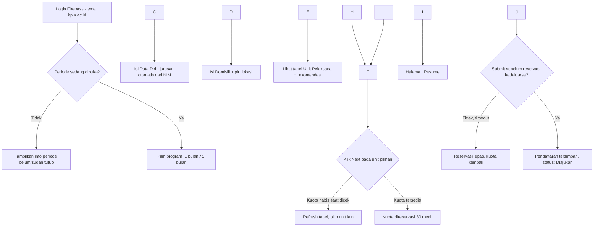
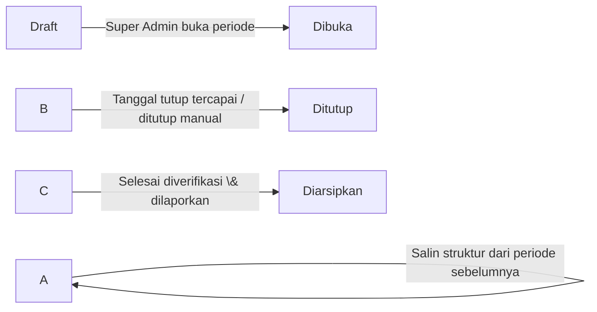

# PRD — Sistem Pendaftaran Magang ITPLN x PT PLN Persero

Versi 1.0 · Dokumen ini bersifat hidup, update tiap ada keputusan produk baru dari BLKA.

## 1\. Latar Belakang \& Tujuan

Saat ini proses pendaftaran magang mahasiswa ITPLN ke PT PLN Persero dan grup usahanya dilakukan secara manual, yang membuat BLKA kesulitan memantau sisa kuota per unit pelaksana secara real-time dan mahasiswa kesulitan menemukan tempat magang yang sesuai domisili serta minat mereka.

Sistem ini dibangun untuk menggantikan proses tersebut dengan platform digital yang menangani pendaftaran mahasiswa, alokasi kuota otomatis, dan rekomendasi tempat magang berbasis radius dan peminatan, sekaligus memberi BLKA panel administrasi untuk mengelola struktur perusahaan, kuota, dan periode pendaftaran setiap tahun ajaran.

**Tujuan utama:**

* Mahasiswa bisa mendaftar magang tanpa bentrok kuota (tidak ada kondisi "sudah keburu penuh" di tengah proses input).
* BLKA bisa membuka periode pendaftaran baru setiap tahun tanpa perlu instalasi ulang atau intervensi developer.
* Data pendaftar tiap periode tercatat rapi untuk keperluan pelaporan ke PLN Pusat.

**Bukan tujuan (V1):** sistem ini tidak menangani proses wawancara/seleksi lanjutan, tidak menangani penilaian magang, dan tidak terintegrasi dengan sistem akademik ITPLN (KRS/nilai) secara otomatis.

## 2\. Definisi Istilah

|Istilah|Arti|
|-|-|
|Periode|Satu siklus pendaftaran magang untuk satu tahun ajaran/gelombang (mis. "Ganjil 2026/2027")|
|Unit Pelaksana|Lokasi magang konkret tempat mahasiswa ditempatkan, berada di bawah Perusahaan Unit Induk|
|Entitas Perusahaan|Istilah umum untuk simpul di hierarki Holding → Subholding → Anak Perusahaan → Perusahaan Unit Induk → Unit Pelaksana|
|Reservasi|Penguncian kuota sementara saat mahasiswa memilih unit pelaksana, sebelum submit final|
|BLKA|Badan Layanan Karir dan Alumni, pemilik proses ini di sisi ITPLN|

## 3\. Role \& Hak Akses

|Aksi|Mahasiswa|Admin BLKA|Super Admin BLKA|
|-|-|-|-|
|Login \& isi form pendaftaran|✅|–|–|
|Lihat status pendaftaran sendiri|✅|–|–|
|Lihat dashboard \& data pendaftar|–|✅|✅|
|CRUD unit pelaksana \& kuota|–|✅|✅|
|Verifikasi/tolak pendaftaran|–|✅|✅|
|Ekspor data pendaftar|–|✅|✅|
|Kelola struktur Holding/Subholding/Anak Perusahaan|–|–|✅|
|Buka/tutup/arsipkan periode|–|–|✅|
|Kelola akun admin lain|–|–|✅|
|Kelola master jurusan \& peminatan|–|–|✅|

Pemisahan Admin BLKA biasa vs Super Admin ini rekomendasi, bukan keputusan final — kalau di lapangan semua staf BLKA punya wewenang sama, dua role ini bisa digabung jadi satu. Tapi kalau ke depan ada rotasi staf atau delegasi terbatas, struktur ini sudah siap dipakai tanpa migrasi skema.

## 4\. Alur Pengguna

### Alur Mahasiswa



### Siklus Hidup Periode (sisi Admin)



## 5\. Functional Requirements

|ID|Modul|Requirement|Prioritas|
|-|-|-|-|
|FR-01|Auth|Login mahasiswa dibatasi domain @itpln.ac.id, diverifikasi di server bukan cuma di client|Must|
|FR-02|Data Diri|Jurusan terisi otomatis dan read-only, diparsing dari 2 digit tengah NIM di email|Must|
|FR-03|Domisili|Input alamat + pin peta open-source, hasil lat/long dipakai untuk hitung radius|Must|
|FR-04|Pemilihan Unit|Tabel unit pelaksana menampilkan status kuota real-time dan skor rekomendasi|Must|
|FR-05|Pemilihan Unit|Kuota terkunci (reservasi) saat mahasiswa klik next, otomatis lepas jika tidak submit dalam 30 menit|Must|
|FR-06|Resume \& Submit|Mahasiswa bisa review seluruh data sebelum submit final, tidak bisa submit dua kali di periode sama|Must|
|FR-07|Dashboard Admin|Menampilkan jumlah pendaftar, distribusi kuota terpakai/tersisa, sebaran peminatan per periode aktif|Must|
|FR-08|CRUD Unit Pelaksana|Admin bisa tambah/ubah/nonaktifkan unit pelaksana beserta kuota per periode|Must|
|FR-09|Struktur Perusahaan|Super Admin bisa kelola hierarki Holding s.d. Unit Induk tanpa batasan jumlah level|Should|
|FR-10|Periode|Super Admin bisa membuat periode baru dengan opsi salin struktur dari periode sebelumnya|Must|
|FR-11|Rekomendasi|Admin bisa input peminatan yang cocok per unit pelaksana untuk memengaruhi skor rekomendasi|Should|
|FR-12|Verifikasi|Admin bisa mengubah status pendaftaran (diverifikasi/ditolak) dan mahasiswa melihat status ini|Should|
|FR-13|Ekspor|Admin bisa mengekspor data pendaftar per periode ke Excel|Must|
|FR-14|Audit|Setiap perubahan kuota dan status oleh admin tercatat di log aktivitas|Must|

## 6\. Desain Database

### Entity-Relationship

```mermaid
erDiagram
    JURUSAN ||--o{ MAHASISWA : memiliki
    MAHASISWA ||--o{ PENDAFTARAN : mengajukan
    PERIODE ||--o{ PENDAFTARAN : mencakup
    PERIODE ||--o{ UNIT\_PELAKSANA\_PERIODE : mencakup
    ENTITAS\_PERUSAHAAN ||--o{ ENTITAS\_PERUSAHAAN : "parent dari"
    ENTITAS\_PERUSAHAAN ||--o{ UNIT\_PELAKSANA\_PERIODE : "disnapshot ke"
    UNIT\_PELAKSANA\_PERIODE ||--o{ RESERVASI : dikunci
    UNIT\_PELAKSANA\_PERIODE ||--o{ PENDAFTARAN : dipilih
    MAHASISWA ||--o{ RESERVASI : membuat
    PENDAFTARAN ||--o{ PENDAFTARAN\_PEMINATAN : memiliki
    PEMINATAN ||--o{ PENDAFTARAN\_PEMINATAN : dipilih
    ENTITAS\_PERUSAHAAN ||--o{ UNIT\_PEMINATAN : cocok
    PEMINATAN ||--o{ UNIT\_PEMINATAN : cocok
    ADMIN ||--o{ LOG\_AKTIVITAS : melakukan
```

### Definisi Tabel

**`jurusan`** — mapping kode jurusan dari NIM, dikelola Super Admin supaya tidak hardcode.

```
id            INT PK
kode          CHAR(2)         -- 2 digit tengah NIM, mis. "31"
nama\_jurusan  VARCHAR(100)
```

**`mahasiswa`** — profil dasar, sinkron dari Firebase saat login pertama.

```
id            INT PK
uid\_firebase  VARCHAR(128) UNIQUE
email         VARCHAR(150) UNIQUE
nim           VARCHAR(10)
nama          VARCHAR(150)
jenis\_kelamin ENUM('L','P')
jurusan\_id    INT FK -> jurusan.id
angkatan      SMALLINT        -- diparsing dari 2 digit awal NIM
no\_urut\_absen SMALLINT        -- diparsing dari 3 digit akhir NIM
created\_at    DATETIME
```

**`periode`**

```
id              INT PK
nama            VARCHAR(50)     -- "Ganjil 2026/2027"
tanggal\_mulai   DATE
tanggal\_selesai DATE
status          ENUM('draft','dibuka','ditutup','diarsipkan')
program\_1\_bulan BOOLEAN
program\_5\_bulan BOOLEAN
```

**`entitas\_perusahaan`** — master hierarki, hidup lintas periode, jarang berubah.

```
id                  INT PK
tipe                ENUM('holding','subholding','anak\_perusahaan','unit\_induk','unit\_pelaksana')
parent\_id           INT FK -> entitas\_perusahaan.id (nullable)
nama                VARCHAR(150)
alamat              TEXT
latitude            DECIMAL(10,7)
longitude           DECIMAL(10,7)
aktif               BOOLEAN
```

**`unit\_pelaksana\_periode`** — snapshot kuota per periode, ini yang benar-benar dipakai saat mahasiswa mendaftar. Master hierarki di atas tidak pernah menyimpan angka kuota.

```
id                  INT PK
entitas\_id          INT FK -> entitas\_perusahaan.id (tipe harus 'unit\_pelaksana')
periode\_id          INT FK -> periode.id
kuota\_total         INT
kuota\_tersisa       INT
UNIQUE(entitas\_id, periode\_id)
```

**`peminatan`** — master pilihan minat, dikelola Super Admin.

```
id      INT PK
nama    VARCHAR(100)
```

**`unit\_peminatan`** — peminatan yang cocok untuk suatu unit, diinput admin untuk mesin rekomendasi.

```
entitas\_id      INT FK -> entitas\_perusahaan.id
peminatan\_id    INT FK -> peminatan.id
PRIMARY KEY(entitas\_id, peminatan\_id)
```

**`reservasi`** — kunci sementara, dibersihkan oleh cron.

```
id                          INT PK
mahasiswa\_id                INT FK -> mahasiswa.id
unit\_pelaksana\_periode\_id   INT FK -> unit\_pelaksana\_periode.id
status                      ENUM('ditahan','dikonfirmasi','kadaluarsa','dibatalkan')
expired\_at                  DATETIME
created\_at                  DATETIME
```

**`pendaftaran`** — hasil final. Alamat dan domisili di-snapshot di sini (bukan hanya rujuk ke profil mahasiswa), supaya kalau mahasiswa update alamat setelahnya, data historis rekomendasi tidak berubah.

```
id                          INT PK
mahasiswa\_id                INT FK -> mahasiswa.id
periode\_id                  INT FK -> periode.id
program                     ENUM('1\_bulan','5\_bulan')
unit\_pelaksana\_periode\_id   INT FK -> unit\_pelaksana\_periode.id
reservasi\_id                INT FK -> reservasi.id
ipk                         DECIMAL(3,2)
jumlah\_sks                  SMALLINT
no\_hp                       VARCHAR(20)
alamat, rt, rw, kelurahan, kecamatan, kota\_kabupaten, provinsi   -- snapshot domisili
latitude, longitude         DECIMAL(10,7)   -- snapshot titik pin saat submit
status                      ENUM('diajukan','diverifikasi','ditolak')
submitted\_at                DATETIME
UNIQUE(mahasiswa\_id, periode\_id)
```

**`pendaftaran\_peminatan`**

```
pendaftaran\_id  INT FK -> pendaftaran.id
peminatan\_id    INT FK -> peminatan.id
PRIMARY KEY(pendaftaran\_id, peminatan\_id)
```

**`admin`**

```
id      INT PK
email   VARCHAR(150) UNIQUE
nama    VARCHAR(150)
role    ENUM('admin\_blka','super\_admin')
```

**`log\_aktivitas`**

```
id          INT PK
admin\_id    INT FK -> admin.id (nullable)
aksi        VARCHAR(100)     -- mis. "ubah\_kuota", "tutup\_periode"
detail\_json JSON             -- nilai sebelum/sesudah
created\_at  DATETIME
```

## 7\. State Machine

|Entitas|Status|Transisi|
|-|-|-|
|Periode|draft → dibuka → ditutup → diarsipkan|Manual oleh Super Admin, atau otomatis "ditutup" saat `tanggal\_selesai` lewat|
|Reservasi|ditahan → dikonfirmasi / kadaluarsa / dibatalkan|dikonfirmasi saat submit sukses; kadaluarsa oleh cron; dibatalkan kalau mahasiswa pilih unit lain sebelum expired|
|Pendaftaran|diajukan → diverifikasi / ditolak|Manual oleh Admin BLKA|

## 8\. Non-Functional Requirements

Detail teknis lengkap (query transaksi, rate limiting, CI/CD, dsb) ada di dokumen terpisah `spec-magang-itpln.md`. Ringkasannya di level PRD:

* Sistem harus tahan terhadap lonjakan trafik di jam pembukaan periode tanpa terjadi kuota minus (dijamin lewat transaksi database, bukan validasi di aplikasi saja).
* Data pribadi mahasiswa tunduk UU PDP, akses dibatasi per role.
* Setiap periode yang sudah diarsipkan datanya tidak bisa diubah lagi, cuma bisa dibaca untuk pelaporan.

## 9\. Asumsi \& Pertanyaan Terbuka

Beberapa hal ini belum ada di percakapan sebelumnya dan perlu dikonfirmasi ke BLKA sebelum development jalan penuh:

* Apakah setelah submit ada tahap wawancara/seleksi tambahan, atau status "diverifikasi" langsung berarti diterima magang? TIDAK ADA, JADI HANYA PENDAFTARAN SAJA DAN NANTI AKAN ADA HALAMAN PENGUMUMAN.
* Apakah mahasiswa boleh membatalkan pendaftaran yang sudah submit dan memilih unit lain (saat ini asumsinya tidak, satu mahasiswa satu pendaftaran final per periode)? LANGSUNG FINAL TIDAK BISA DIUBAH
* Apakah perlu upload dokumen (KTM, transkrip, surat pengantar) di form, atau cukup data yang sudah disebutkan? TIDAK ADA.
* Berapa lama masa reservasi yang ideal — dokumen ini asumsi 30 menit, tapi ini angka yang sebaiknya dites ke pengguna nyata.

## 10\. Out of Scope (V1)

Notifikasi WhatsApp/email otomatis, integrasi nilai akademik, proses magang pasca-penempatan (logbook, penilaian dosen pembimbing) — ini semua kandidat kuat untuk V2, tapi sengaja tidak masuk versi pertama supaya rilis awal tidak molor.

